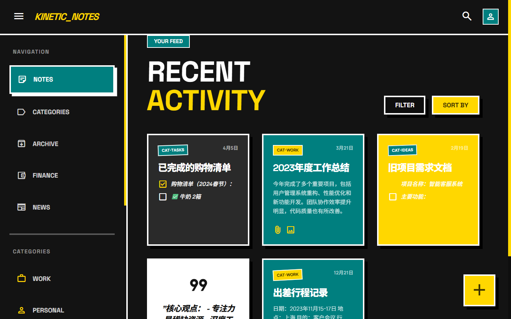
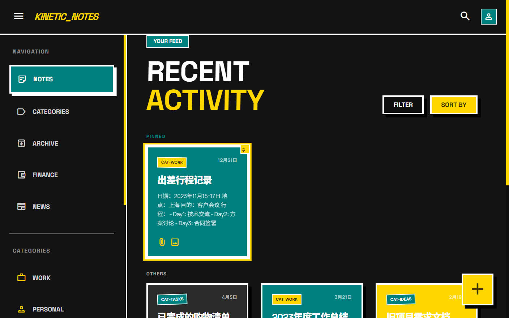
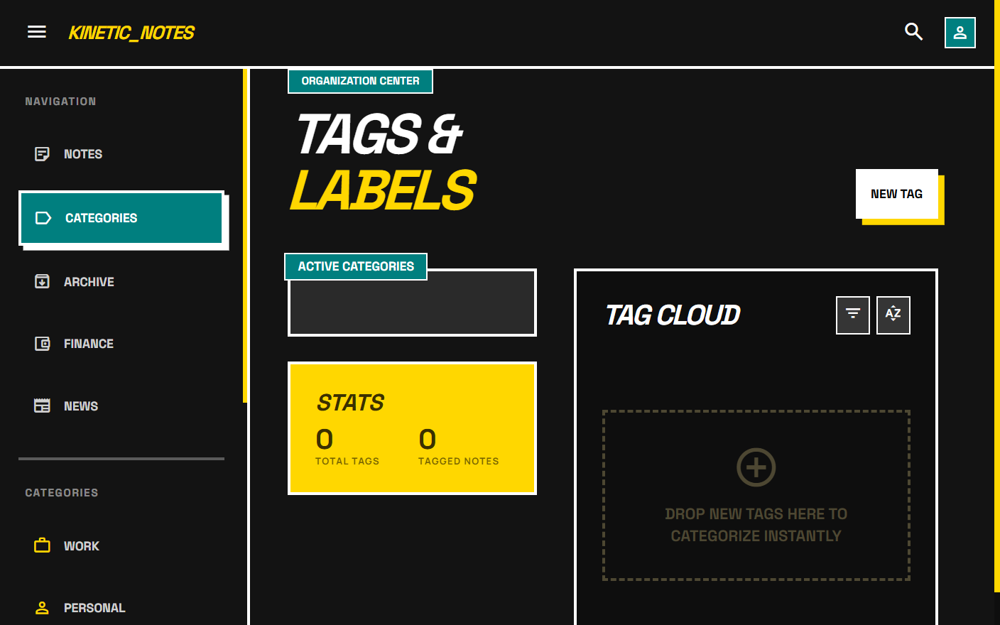
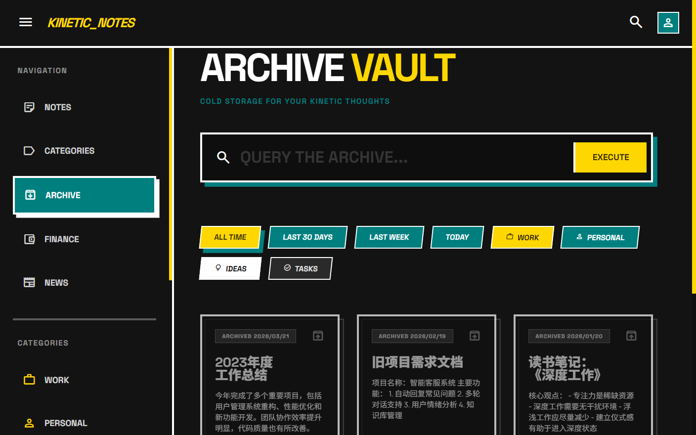
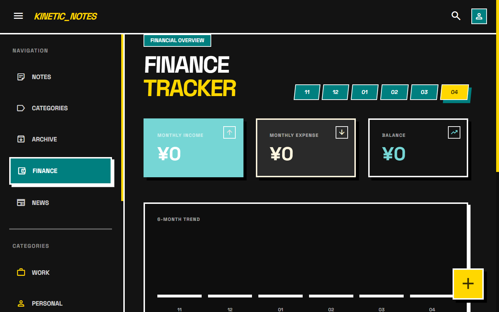
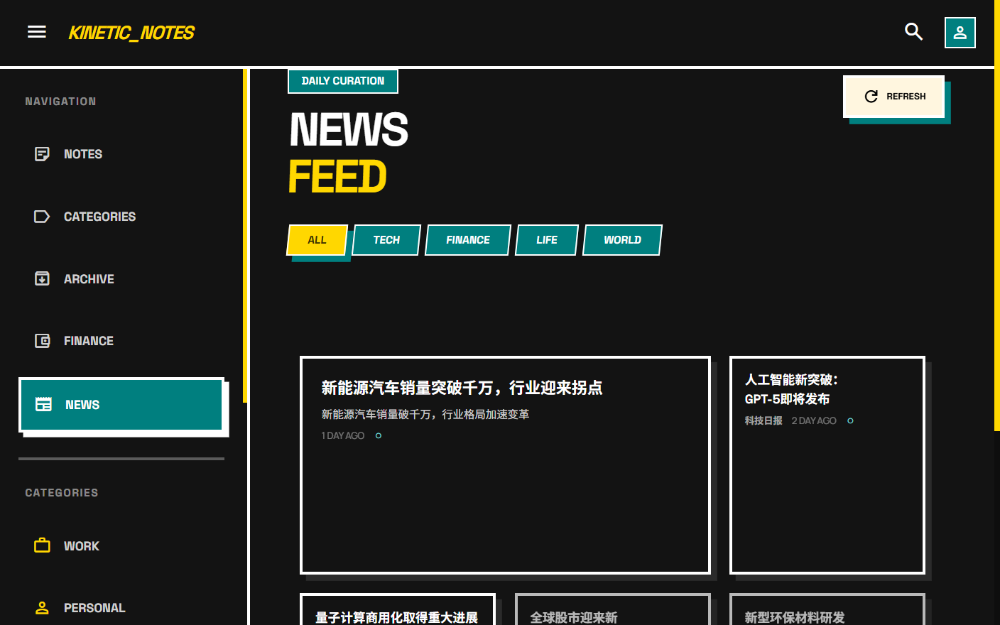
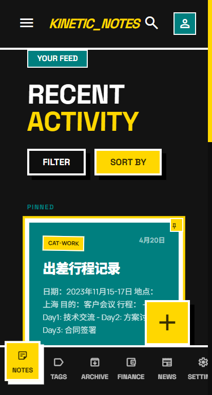

# MiniAI Notepad

一个极简记事本项目，用于验证 AI 驱动软件开发工作流程。

## 项目简介

本项目使用国产大模型 GLM-5 + Claude Code 实现，全程零手敲代码，纯 AI 生成。

> 详细实践过程见：[教程文档](docs/tutorial.md)

## 功能特性

- **笔记管理** - 创建、编辑、删除笔记，支持富文本格式
- **分类系统** - 按类别组织笔记，支持自定义分类
- **归档功能** - 将完成的笔记归档保存
- **财务记录** - 简单的收支记账功能
- **新闻聚合** - 收集和整理重要资讯
- **本地存储** - 使用 IndexedDB 实现离线数据持久化
- **响应式设计** - 支持桌面端和移动端

## 应用截图

### 桌面端













### 移动端



## 技术栈

- **前端框架**: Vue 3 + TypeScript
- **状态管理**: Pinia
- **路由**: Vue Router
- **样式**: Tailwind CSS (Neo-Brutalist 风格)
- **存储**: IndexedDB (Dexie)
- **富文本编辑**: TipTap
- **构建工具**: Vite

## 开发运行

```bash
# 安装依赖
npm install

# 启动开发服务器
npm run dev

# 构建生产版本
npm run build

# 类型检查
npm run type-check

# 运行测试
npm run test
```

## 项目结构

```
src/
├── assets/          # 静态资源
├── components/      # 组件
│   ├── base/        # 基础组件
│   ├── common/      # 通用组件
│   └── business/    # 业务组件
├── composables/     # 组合式函数
├── pages/           # 页面组件
├── repositories/    # 数据仓库层
├── stores/          # Pinia 状态管理
├── types/           # TypeScript 类型定义
├── utils/           # 工具函数
├── router.ts        # 路由配置
├── App.vue          # 根组件
└── main.ts          # 入口文件
```

## 相关资源

- [software-dev-ai-workflow](https://github.com/cilangzzz/software-dev-ai-workflow) - AI 驱动软件开发工作流 Skill 集合

## 许可证

MIT