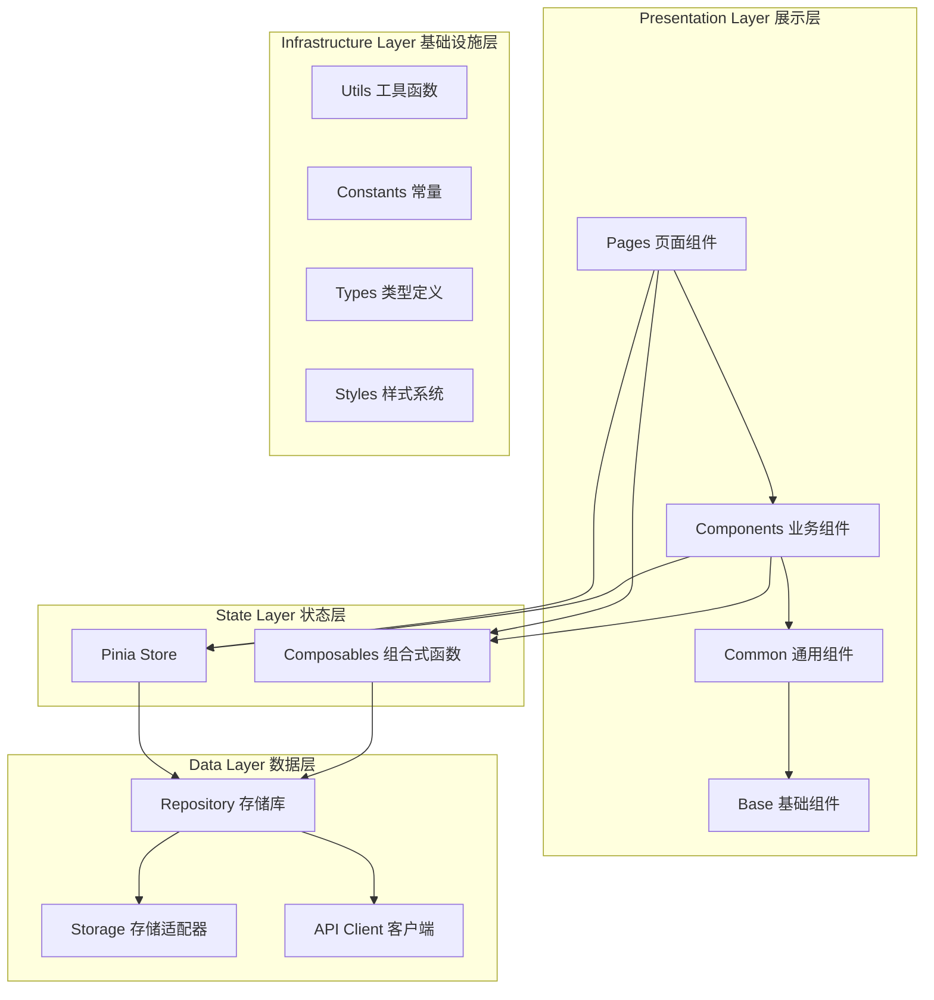
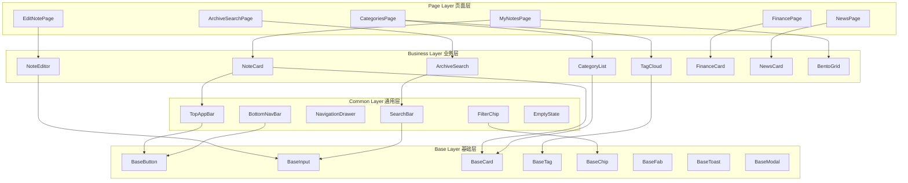
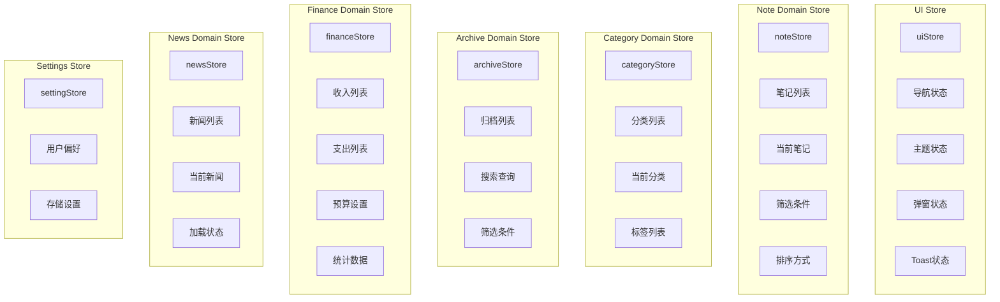
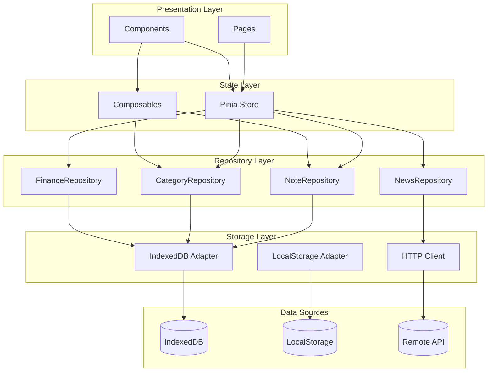
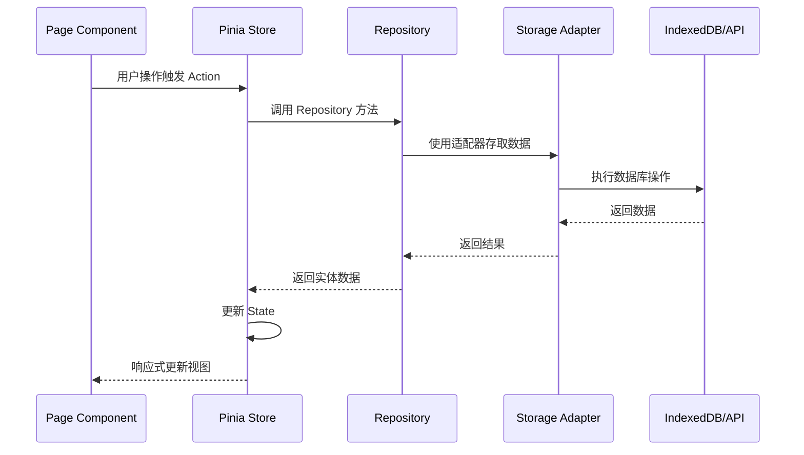
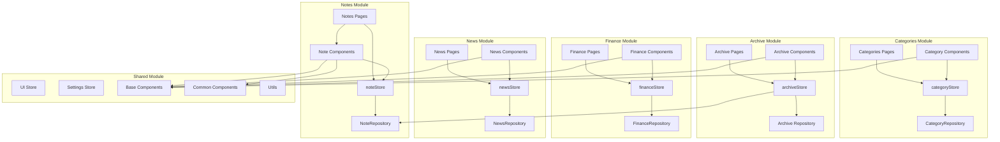

# MiniAI记事本系统架构设计

## 文档信息

| 属性 | 值 |
|------|-----|
| 项目名称 | KINETIC_NOTES (MiniAI记事本) |
| 文档版本 | v1.0 |
| 创建日期 | 2026-04-20 |
| 架构师 | Claude AI |
| 技术栈 | Vue3 + TypeScript + Vite |

---

## 1. 系统架构概览

### 1.1 架构总览图



### 1.2 架构分层说明

| 层级 | 职责 | 依赖方向 |
|------|------|----------|
| Presentation Layer | UI渲染、用户交互、页面路由 | 依赖 State Layer |
| State Layer | 状态管理、业务逻辑封装 | 依赖 Data Layer |
| Data Layer | 数据存取抽象、存储适配 | 依赖 Infrastructure Layer |
| Infrastructure Layer | 工具函数、常量、类型、样式 | 无外部依赖 |

---

## 2. 目录结构设计

```
src/
├── app/                          # 应用入口层
│   ├── App.vue                   # 根组件
│   ├── main.ts                   # 应用入口
│   └── router/                   # 路由配置
│       ├── index.ts              # 路由入口
│       ├── routes.ts             # 路由定义
│       └── guards.ts             # 路由守卫
│
├── assets/                       # 静态资源
│   ├── fonts/                    # 字体文件
│   │   ├── SpaceGrotesk/         # 标题字体
│   │   └── Manrope/              # 正文字体
│   ├── images/                   # 图片资源
│   │   ├── icons/                # 图标
│   │   └── logos/                # 品牌标识
│   └── styles/                   # 样式文件
│       ├── variables.css         # CSS变量定义
│       ├── reset.css             # 样式重置
│       ├── neo-brutalist.css     # Neo-Brutalist设计系统
│       ├── typography.css        # 字体排版
│       ├── utilities.css         # 工具类样式
│       └── main.css              # 样式入口
│
├── components/                   # 组件层
│   ├── base/                     # 基础组件 (Base*)
│   │   ├── BaseButton.vue        # 按钮组件
│   │   ├── BaseInput.vue         # 输入框组件
│   │   ├── BaseCard.vue          # 卡片组件
│   │   ├── BaseTag.vue           # 标签组件
│   │   ├── BaseChip.vue          # 芯片组件
│   │   ├── BaseFab.vue           # FAB按钮组件
│   │   ├── BaseToast.vue         # Toast提示组件
│   │   ├── BaseModal.vue         # 弹窗组件
│   │   ├── BaseLoading.vue       # 加载组件
│   │   ├── BaseProgress.vue      # 进度条组件
│   │   ├── BaseIcon.vue          # 图标组件
│   │   ├── BaseDivider.vue       # 分割线组件
│   │   └── index.ts              # 导出索引
│   │
│   ├── common/                   # 通用组件
│   │   ├── TopAppBar.vue         # 顶部导航栏
│   │   ├── BottomNavBar.vue      # 底部导航栏
│   │   ├── NavigationDrawer.vue  # 侧边栏导航
│   │   ├── SearchBar.vue         # 搜索栏
│   │   ├── FilterChip.vue        # 筛选芯片
│   │   ├── SortButton.vue        # 排序按钮
│   │   ├── StorageIndicator.vue  # 存储容量指示器
│   │   ├── EmptyState.vue        # 空状态组件
│   │   ├── ConfirmDialog.vue     # 确认弹窗
│   │   └── index.ts              # 导出索引
│   │
│   ├── business/                 # 业务组件
│   │   ├── note/                 # 笔记业务组件
│   │   │   ├── NoteCard.vue      # 笔记卡片
│   │   │   ├── NoteCardGrid.vue  # 笔记卡片网格
│   │   │   ├── NoteEditor.vue    # 笔记编辑器
│   │   │   ├── NoteTagManager.vue # 标签管理器
│   │   │   ├── NoteAppearance.vue # 外观控制器
│   │   │   └── index.ts
│   │   │
│   │   ├── category/             # 分类业务组件
│   │   │   ├── CategoryList.vue  # 分类列表
│   │   │   ├── CategoryItem.vue  # 分类项
│   │   │   ├── TagCloud.vue      # 标签云
│   │   │   ├── TagStats.vue      # 标签统计
│   │   │   └── index.ts
│   │   │
│   │   ├── archive/              # 归档业务组件
│   │   │   ├── ArchiveSearch.vue # 归档搜索
│   │   │   ├── ArchiveCard.vue   # 归档卡片
│   │   │   ├── ArchiveResult.vue # 归档结果
│   │   │   └── index.ts
│   │   │
│   │   ├── finance/              # 财务业务组件
│   │   │   ├── FinanceCard.vue   # 财务数字卡片
│   │   │   ├── FinancePieChart.vue # 饼图
│   │   │   ├── FinanceLineChart.vue # 折线图
│   │   │   ├── IncomeForm.vue    # 收入表单
│   │   │   ├── ExpenseForm.vue   # 支出表单
│   │   │   ├── BudgetProgress.vue # 预算进度条
│   │   │   └── index.ts
│   │   │
│   │   ├── news/                 # 新闻业务组件
│   │   │   ├── NewsCard.vue      # 新闻卡片
│   │   │   ├── NewsGrid.vue      # 新闻网格
│   │   │   ├── NewsDetail.vue    # 新闻详情
│   │   │   └── index.ts
│   │   │
│   │   └── layout/               # 布局业务组件
│   │       ├── BentoGrid.vue     # Bento网格布局
│   │       ├── ResponsiveLayout.vue # 响应式布局
│   │       ├── PageContainer.vue # 页面容器
│   │       └── index.ts
│   │
│   └── index.ts                  # 组件总导出
│
├── composables/                  # 组合式函数
│   ├── useNotes.ts               # 笔记相关逻辑
│   ├── useCategories.ts          # 分类相关逻辑
│   ├── useTags.ts                # 标签相关逻辑
│   ├── useArchive.ts             # 归档相关逻辑
│   ├── useFinance.ts             # 财务相关逻辑
│   ├── useNews.ts                # 新闻相关逻辑
│   ├── useResponsive.ts          # 响应式布局
│   ├── useStorage.ts             # 存储容量计算
│   ├── useSearch.ts              # 搜索功能
│   ├── useFilter.ts              # 筛选功能
│   ├── useSort.ts                # 排序功能
│   ├── useToast.ts               # Toast提示
│   └── index.ts
│
├── pages/                        # 页面组件
│   ├── notes/                    # 记事本模块页面
│   │   ├── MyNotesPage.vue       # 笔记列表页 (my_notes)
│   │   ├── EditNotePage.vue      # 笔记编辑页 (edit_note)
│   │   └── NoteDetailPage.vue    # 笔记详情页
│   │
│   ├── categories/               # 分类标签模块页面
│   │   └── CategoriesPage.vue    # 分类标签页
│   │
│   ├── archive/                  # 归档搜索模块页面
│   │   └── ArchiveSearchPage.vue # 归档搜索页
│   │
│   ├── finance/                  # 财务模块页面
│   │   ├── FinancePage.vue       # 收支概览页
│   │   ├── IncomePage.vue        # 收入管理页
│   │   └── ExpensePage.vue       # 支出管理页
│   │
│   ├── news/                     # 新闻模块页面
│   │   ├── NewsPage.vue          # 新闻列表页
│   │   └── NewsDetailPage.vue    # 新闻详情页
│   │
│   ├── settings/                 # 设置模块页面
│   │   └── SettingsPage.vue      # 设置页
│   │
│   └── layouts/                  # 页面布局
│       ├── MobileLayout.vue      # 移动端布局
│       └── DesktopLayout.vue     # 桌面端布局
│
├── stores/                       # Pinia状态管理
│   ├── modules/                  # 状态模块
│   │   ├── noteStore.ts          # 笔记状态
│   │   ├── categoryStore.ts      # 分类状态
│   │   ├── tagStore.ts           # 标签状态
│   │   ├── archiveStore.ts       # 归档状态
│   │   ├── financeStore.ts       # 财务状态
│   │   ├── newsStore.ts          # 新闻状态
│   │   ├── settingStore.ts       # 设置状态
│   │   └── uiStore.ts            # UI状态(导航、主题等)
│   │
│   └── index.ts                  # Store入口
│
├── repositories/                 # 数据仓库层
│   ├── base/                     # 基础仓库
│   │   ├── BaseRepository.ts     # 仓库基类
│   │   └── IRepository.ts       # 仓库接口定义
│   │
│   ├── note/                     # 笔记数据仓库
│   │   ├── INoteRepository.ts    # 笔记仓库接口
│   │   ├── NoteRepository.ts     # 笔记仓库实现
│   │   └── index.ts
│   │
│   ├── category/                 # 分类数据仓库
│   │   ├── ICategoryRepository.ts
│   │   ├── CategoryRepository.ts
│   │   └── index.ts
│   │
│   ├── finance/                  # 财务数据仓库
│   │   ├── IFinanceRepository.ts
│   │   ├── FinanceRepository.ts
│   │   └── index.ts
│   │
│   ├── news/                     # 新闻数据仓库
│   │   ├── INewsRepository.ts
│   │   ├── NewsRepository.ts     # 远程API实现
│   │   └── index.ts
│   │
│   └── index.ts                  # 仓库导出
│
├── storage/                      # 存储适配层
│   ├── adapters/                 # 存储适配器
│   │   ├── IndexedDBAdapter.ts   # IndexedDB适配器
│   │   ├── LocalStorageAdapter.ts # LocalStorage适配器
│   │   └── IStorageAdapter.ts    # 存储适配器接口
│   │
│   ├── schemas/                  # 数据模式定义
│   │   ├── noteSchema.ts         # 笔记数据模式
│   │   ├── categorySchema.ts    # 分类数据模式
│   │   ├── financeSchema.ts      # 财务数据模式
│   │   └── index.ts
│   │
│   ├── migrations/               # 数据迁移
│   │   └── index.ts
│   │
│   └── index.ts                  # 存储导出
│
├── api/                          # API层
│   ├── client/                   # API客户端
│   │   ├── HttpClient.ts         # HTTP客户端封装
│   │   └── ApiClient.ts          # API客户端
│   │
│   ├── endpoints/                # API端点
│   │   ├── news.ts               # 新闻API
│   │   └── sync.ts               # 同步API(P2)
│   │
│   ├── interceptors/             # 拦截器
│   │   ├── requestInterceptor.ts
│   │   └── responseInterceptor.ts
│   │
│   └── index.ts
│
├── types/                        # TypeScript类型定义
│   ├── entities/                 # 实体类型
│   │   ├── note.types.ts         # 笔记相关类型
│   │   ├── category.types.ts    # 分类相关类型
│   │   ├── tag.types.ts          # 标签相关类型
│   │   ├── finance.types.ts      # 财务相关类型
│   │   ├── news.types.ts         # 新闻相关类型
│   │   └── index.ts
│   │
│   ├── api/                      # API类型
│   │   ├── response.types.ts     # 响应类型
│   │   ├── request.types.ts      # 请求类型
│   │   └── index.ts
│   │
│   ├── store/                    # Store类型
│   │   ├── noteStore.types.ts
│   │   └── index.ts
│   │
│   ├── common/                   # 公共类型
│   │   ├── result.types.ts       # 结果类型
│   │   ├── pagination.types.ts   # 分页类型
│   │   └── index.ts
│   │
│   └── index.ts
│
├── constants/                    # 常量定义
│   ├── app.constants.ts          # 应用常量
│   ├── routes.constants.ts       # 路由常量
│   ├── colors.constants.ts       # 颜色常量
│   ├── categories.constants.ts   # 预设分类
│   ├── storage.constants.ts      # 存储常量
│   └── index.ts
│
├── utils/                        # 工具函数
│   ├── date.ts                   # 日期处理
│   ├── uuid.ts                   # UUID生成
│   ├── validation.ts             # 验证函数
│   ├── formatting.ts             # 格式化函数
│   ├── storage.ts                # 存储工具
│   ├── debounce.ts               # 防抖节流
│   ├── sort.ts                   # 排序工具
│   ├── filter.ts                 # 筛选工具
│   └── index.ts
│
├── config/                       # 配置文件
│   ├── app.config.ts             # 应用配置
│   ├── theme.config.ts           # 主题配置
│   ├── api.config.ts             # API配置
│   └── index.ts
│
├── env.d.ts                      # 环境变量类型
└── vite-env.d.ts                 # Vite环境类型
```

---

## 3. 组件层级设计

### 3.1 组件分层架构



### 3.2 组件详细设计

#### 3.2.1 Base层组件 (基础组件)

**设计原则：**
- 无业务逻辑，纯UI展示
- 高度可配置，通过Props控制
- 支持v-model双向绑定
- 遵循Neo-Brutalist设计规范

| 组件名 | 用途 | 核心Props | 事件 |
|--------|------|-----------|------|
| BaseButton | 按钮 | variant, color, size, disabled, loading | click |
| BaseInput | 输入框 | type, value, placeholder, disabled, error | update:modelValue |
| BaseCard | 卡片容器 | variant, color, hover, padding | click |
| BaseTag | 标签 | text, color, rotation, removable | remove |
| BaseChip | 芯片 | text, color, selected, disabled | click |
| BaseFab | FAB按钮 | icon, color, position | click |
| BaseToast | Toast提示 | message, type, duration | close |
| BaseModal | 弹窗 | visible, title, size | close, confirm |
| BaseLoading | 加载动画 | size, color | - |
| BaseProgress | 进度条 | value, max, color | - |
| BaseIcon | 图标 | name, size, color | - |
| BaseDivider | 分割线 | direction, color | - |

#### 3.2.2 Common层组件 (通用组件)

**设计原则：**
- 组合Base组件
- 包含简单交互逻辑
- 可跨模块复用
- 支持Neo-Brutalist风格

| 组件名 | 用途 | 组合基础组件 | 事件 |
|--------|------|--------------|------|
| TopAppBar | 顶部导航栏 | BaseButton, BaseIcon | menu, search, profile |
| BottomNavBar | 底部导航栏 | BaseButton, BaseIcon | navigate |
| NavigationDrawer | 侧边栏导航 | BaseCard, BaseIcon | select |
| SearchBar | 搜索栏 | BaseInput, BaseButton | search, clear |
| FilterChip | 筛选芯片 | BaseChip | filter |
| SortButton | 排序按钮 | BaseButton, BaseIcon | sort |
| StorageIndicator | 存储指示器 | BaseProgress, BaseCard | - |
| EmptyState | 空状态 | BaseIcon, BaseCard | action |
| ConfirmDialog | 确认弹窗 | BaseModal, BaseButton | confirm, cancel |

#### 3.2.3 Business层组件 (业务组件)

**设计原则：**
- 组合Common和Base组件
- 封装业务逻辑
- 与Store交互
- 模块内复用

| 模块 | 组件名 | 用途 | Props | 事件 |
|------|--------|------|-------|------|
| note | NoteCard | 笔记卡片 | note, variant | edit, archive, delete |
| note | NoteCardGrid | 笔记网格 | notes, columns | select |
| note | NoteEditor | 笔记编辑器 | note | save, cancel |
| note | NoteTagManager | 标签管理器 | tags, selectedTags | add, remove |
| note | NoteAppearance | 外观控制器 | color, fontWeight | change |
| category | CategoryList | 分类列表 | categories | select, edit, delete |
| category | TagCloud | 标签云 | tags | select |
| category | TagStats | 标签统计 | stats | - |
| archive | ArchiveSearch | 归档搜索 | - | search |
| archive | ArchiveCard | 归档卡片 | note | restore |
| finance | FinanceCard | 财务数字卡片 | title, amount, type | - |
| finance | IncomeForm | 收入表单 | income | submit, cancel |
| finance | ExpenseForm | 支出表单 | expense | submit, cancel |
| finance | BudgetProgress | 预算进度 | budget, spent | - |
| news | NewsCard | 新闻卡片 | news | click, save |
| news | NewsGrid | 新闻网格 | newsList | - |
| layout | BentoGrid | Bento网格 | items, columns | - |
| layout | ResponsiveLayout | 响应式布局 | - | breakpoint-change |

#### 3.2.4 Page层组件 (页面组件)

**设计原则：**
- 页面级路由入口
- 组合Business组件
- 管理页面状态
- 响应式布局切换

| 模块 | 页面 | 路由 | 布局 |
|------|------|------|------|
| notes | MyNotesPage | /notes | 响应式 |
| notes | EditNotePage | /notes/edit/:id? | 响应式 |
| notes | NoteDetailPage | /notes/:id | 响应式 |
| categories | CategoriesPage | /categories | 响应式 |
| archive | ArchiveSearchPage | /archive | 响应式 |
| finance | FinancePage | /finance | 响应式 |
| finance | IncomePage | /finance/income | 响应式 |
| finance | ExpensePage | /finance/expense | 响应式 |
| news | NewsPage | /news | 响应式 |
| news | NewsDetailPage | /news/:id | 响应式 |
| settings | SettingsPage | /settings | 响应式 |

---

## 4. 状态管理架构

### 4.1 Pinia Store 架构图



### 4.2 Store 详细设计

#### 4.2.1 noteStore 笔记状态

```typescript
// stores/modules/noteStore.ts
import { defineStore } from 'pinia'
import { ref, computed } from 'vue'
import type { Note, NoteFilter, NoteSort } from '@/types/entities'
import { noteRepository } from '@/repositories/note'

export const useNoteStore = defineStore('note', () => {
  // State
  const notes = ref<Note[]>([])
  const currentNote = ref<Note | null>(null)
  const filter = ref<NoteFilter>({
    category: null,
    tags: [],
    isArchived: false
  })
  const sort = ref<NoteSort>({
    field: 'updatedAt',
    order: 'desc'
  })
  const loading = ref(false)
  const error = ref<string | null>(null)

  // Getters
  const filteredNotes = computed(() => {
    let result = notes.value.filter(n => !n.isArchived)

    if (filter.value.category) {
      result = result.filter(n => n.category === filter.value.category)
    }

    if (filter.value.tags.length > 0) {
      result = result.filter(n =>
        filter.value.tags.some(tag => n.tags.includes(tag))
      )
    }

    // 排序
    result.sort((a, b) => {
      const fieldA = a[sort.value.field]
      const fieldB = b[sort.value.field]
      return sort.value.order === 'desc'
        ? fieldB.localeCompare(fieldA)
        : fieldA.localeCompare(fieldB)
    })

    return result
  })

  const notesByCategory = computed(() => {
    return notes.value.reduce((acc, note) => {
      const cat = note.category
      if (!acc[cat]) acc[cat] = []
      acc[cat].push(note)
      return acc
    }, {} as Record<string, Note[]>)
  })

  const pinnedNotes = computed(() =>
    notes.value.filter(n => n.isPinned && !n.isArchived)
  )

  // Actions
  async function fetchNotes() {
    loading.value = true
    error.value = null
    try {
      notes.value = await noteRepository.findAll()
    } catch (e) {
      error.value = '获取笔记列表失败'
      throw e
    } finally {
      loading.value = false
    }
  }

  async function createNote(note: Omit<Note, 'id' | 'createdAt' | 'updatedAt'>) {
    loading.value = true
    try {
      const newNote = await noteRepository.create(note)
      notes.value.unshift(newNote)
      return newNote
    } finally {
      loading.value = false
    }
  }

  async function updateNote(id: string, updates: Partial<Note>) {
    loading.value = true
    try {
      const updated = await noteRepository.update(id, {
        ...updates,
        updatedAt: new Date().toISOString()
      })
      const index = notes.value.findIndex(n => n.id === id)
      if (index !== -1) {
        notes.value[index] = updated
      }
      return updated
    } finally {
      loading.value = false
    }
  }

  async function archiveNote(id: string) {
    await updateNote(id, {
      isArchived: true,
      archivedAt: new Date().toISOString()
    })
  }

  async function restoreNote(id: string) {
    await updateNote(id, {
      isArchived: false,
      archivedAt: null
    })
  }

  async function deleteNote(id: string) {
    loading.value = true
    try {
      await noteRepository.delete(id)
      notes.value = notes.value.filter(n => n.id !== id)
    } finally {
      loading.value = false
    }
  }

  function setFilter(newFilter: Partial<NoteFilter>) {
    filter.value = { ...filter.value, ...newFilter }
  }

  function setSort(newSort: Partial<NoteSort>) {
    sort.value = { ...sort.value, ...newSort }
  }

  function clearFilter() {
    filter.value = { category: null, tags: [], isArchived: false }
  }

  return {
    // State
    notes,
    currentNote,
    filter,
    sort,
    loading,
    error,
    // Getters
    filteredNotes,
    notesByCategory,
    pinnedNotes,
    // Actions
    fetchNotes,
    createNote,
    updateNote,
    archiveNote,
    restoreNote,
    deleteNote,
    setFilter,
    setSort,
    clearFilter
  }
})
```

#### 4.2.2 其他Store设计概要

| Store | State | Getters | Actions |
|-------|-------|---------|---------|
| categoryStore | categories, currentCategory, tags | categoryOptions, tagCloud | fetchCategories, createCategory, updateCategory, deleteCategory |
| archiveStore | archivedNotes, searchQuery, filters | searchResults | search, restoreNote, deletePermanent |
| financeStore | incomes, expenses, budget, stats | totalIncome, totalExpense, balance, expensesByCategory | addIncome, addExpense, updateBudget, fetchStats |
| newsStore | newsList, currentNews, loading, error | featuredNews | fetchNews, getDetail, saveToNote |
| uiStore | navigation, theme, modals, toasts | isMobile, isDesktop | setTheme, showModal, showToast |
| settingStore | preferences, storageInfo | themeOptions, storageUsed | updatePreference, exportData |

---

## 5. 数据流架构 (Repository模式)

### 5.1 Repository层架构图



### 5.2 Repository接口设计

#### 5.2.1 基础Repository接口

```typescript
// repositories/base/IRepository.ts
export interface IRepository<T, CreateDTO, UpdateDTO> {
  findAll(): Promise<T[]>
  findById(id: string): Promise<T | null>
  create(data: CreateDTO): Promise<T>
  update(id: string, data: UpdateDTO): Promise<T>
  delete(id: string): Promise<void>
  count(): Promise<number>
}

// repositories/base/BaseRepository.ts
import type { IStorageAdapter } from '@/storage/adapters/IStorageAdapter'

export abstract class BaseRepository<T, CreateDTO, UpdateDTO>
  implements IRepository<T, CreateDTO, UpdateDTO> {

  protected storage: IStorageAdapter<T>
  protected storeName: string

  constructor(storage: IStorageAdapter<T>, storeName: string) {
    this.storage = storage
    this.storeName = storeName
  }

  async findAll(): Promise<T[]> {
    return this.storage.getAll(this.storeName)
  }

  async findById(id: string): Promise<T | null> {
    return this.storage.get(this.storeName, id)
  }

  async create(data: CreateDTO): Promise<T> {
    const entity = {
      id: this.generateId(),
      ...data,
      createdAt: new Date().toISOString(),
      updatedAt: new Date().toISOString()
    } as T

    await this.storage.set(this.storeName, entity.id as string, entity)
    return entity
  }

  async update(id: string, data: UpdateDTO): Promise<T> {
    const existing = await this.findById(id)
    if (!existing) {
      throw new Error(`Entity with id ${id} not found`)
    }

    const updated = {
      ...existing,
      ...data,
      updatedAt: new Date().toISOString()
    } as T

    await this.storage.set(this.storeName, id, updated)
    return updated
  }

  async delete(id: string): Promise<void> {
    await this.storage.delete(this.storeName, id)
  }

  async count(): Promise<number> {
    return this.storage.count(this.storeName)
  }

  protected generateId(): string {
    return crypto.randomUUID()
  }
}
```

#### 5.2.2 笔记Repository接口与实现

```typescript
// repositories/note/INoteRepository.ts
import type { Note, NoteCreateDTO, NoteUpdateDTO } from '@/types/entities'
import type { IRepository } from '@/repositories/base/IRepository'

export interface INoteRepository extends IRepository<Note, NoteCreateDTO, NoteUpdateDTO> {
  findByCategory(category: string): Promise<Note[]>
  findByTag(tag: string): Promise<Note[]>
  findArchived(): Promise<Note[]>
  search(query: string): Promise<Note[]>
  archive(id: string): Promise<void>
  restore(id: string): Promise<void>
  togglePin(id: string): Promise<void>
}

// repositories/note/NoteRepository.ts
import { BaseRepository } from '@/repositories/base/BaseRepository'
import type { INoteRepository } from './INoteRepository'
import type { Note, NoteCreateDTO, NoteUpdateDTO } from '@/types/entities'
import type { IStorageAdapter } from '@/storage/adapters/IStorageAdapter'

export class NoteRepository
  extends BaseRepository<Note, NoteCreateDTO, NoteUpdateDTO>
  implements INoteRepository {

  constructor(storage: IStorageAdapter<Note>) {
    super(storage, 'notes')
  }

  async findByCategory(category: string): Promise<Note[]> {
    const all = await this.findAll()
    return all.filter(note => note.category === category)
  }

  async findByTag(tag: string): Promise<Note[]> {
    const all = await this.findAll()
    return all.filter(note => note.tags.includes(tag))
  }

  async findArchived(): Promise<Note[]> {
    const all = await this.findAll()
    return all.filter(note => note.isArchived)
  }

  async search(query: string): Promise<Note[]> {
    const all = await this.findAll()
    const lowerQuery = query.toLowerCase()
    return all.filter(note =>
      note.title.toLowerCase().includes(lowerQuery) ||
      note.content.toLowerCase().includes(lowerQuery) ||
      note.tags.some(tag => tag.toLowerCase().includes(lowerQuery))
    )
  }

  async archive(id: string): Promise<void> {
    await this.update(id, {
      isArchived: true,
      archivedAt: new Date().toISOString()
    } as NoteUpdateDTO)
  }

  async restore(id: string): Promise<void> {
    await this.update(id, {
      isArchived: false,
      archivedAt: null
    } as NoteUpdateDTO)
  }

  async togglePin(id: string): Promise<void> {
    const note = await this.findById(id)
    if (note) {
      await this.update(id, {
        isPinned: !note.isPinned
      } as NoteUpdateDTO)
    }
  }
}
```

#### 5.2.3 财务Repository接口与实现

```typescript
// repositories/finance/IFinanceRepository.ts
import type { Income, Expense, IncomeCreateDTO, ExpenseCreateDTO } from '@/types/entities'

export interface IFinanceRepository {
  // Income operations
  findAllIncomes(): Promise<Income[]>
  findIncomeById(id: string): Promise<Income | null>
  createIncome(data: IncomeCreateDTO): Promise<Income>
  deleteIncome(id: string): Promise<void>

  // Expense operations
  findAllExpenses(): Promise<Expense[]>
  findExpenseById(id: string): Promise<Expense | null>
  createExpense(data: ExpenseCreateDTO): Promise<Expense>
  deleteExpense(id: string): Promise<void>

  // Statistics
  getTotalIncome(startDate?: Date, endDate?: Date): Promise<number>
  getTotalExpense(startDate?: Date, endDate?: Date): Promise<number>
  getExpensesByCategory(startDate?: Date, endDate?: Date): Promise<Record<string, number>>
}

// repositories/finance/FinanceRepository.ts
import type { IFinanceRepository } from './IFinanceRepository'
import type { Income, Expense, IncomeCreateDTO, ExpenseCreateDTO } from '@/types/entities'
import type { IStorageAdapter } from '@/storage/adapters/IStorageAdapter'

export class FinanceRepository implements IFinanceRepository {
  private incomeStorage: IStorageAdapter<Income>
  private expenseStorage: IStorageAdapter<Expense>

  constructor(
    incomeStorage: IStorageAdapter<Income>,
    expenseStorage: IStorageAdapter<Expense>
  ) {
    this.incomeStorage = incomeStorage
    this.expenseStorage = expenseStorage
  }

  // Income operations
  async findAllIncomes(): Promise<Income[]> {
    return this.incomeStorage.getAll('incomes')
  }

  async findIncomeById(id: string): Promise<Income | null> {
    return this.incomeStorage.get('incomes', id)
  }

  async createIncome(data: IncomeCreateDTO): Promise<Income> {
    const income: Income = {
      id: crypto.randomUUID(),
      ...data,
      createdAt: new Date().toISOString()
    }
    await this.incomeStorage.set('incomes', income.id, income)
    return income
  }

  async deleteIncome(id: string): Promise<void> {
    await this.incomeStorage.delete('incomes', id)
  }

  // Expense operations
  async findAllExpenses(): Promise<Expense[]> {
    return this.expenseStorage.getAll('expenses')
  }

  async findExpenseById(id: string): Promise<Expense | null> {
    return this.expenseStorage.get('expenses', id)
  }

  async createExpense(data: ExpenseCreateDTO): Promise<Expense> {
    const expense: Expense = {
      id: crypto.randomUUID(),
      ...data,
      createdAt: new Date().toISOString()
    }
    await this.expenseStorage.set('expenses', expense.id, expense)
    return expense
  }

  async deleteExpense(id: string): Promise<void> {
    await this.expenseStorage.delete('expenses', id)
  }

  // Statistics
  async getTotalIncome(startDate?: Date, endDate?: Date): Promise<number> {
    const incomes = await this.filterByDateRange(
      await this.findAllIncomes(),
      startDate,
      endDate
    )
    return incomes.reduce((sum, i) => sum + i.amount, 0)
  }

  async getTotalExpense(startDate?: Date, endDate?: Date): Promise<number> {
    const expenses = await this.filterByDateRange(
      await this.findAllExpenses(),
      startDate,
      endDate
    )
    return expenses.reduce((sum, e) => sum + e.amount, 0)
  }

  async getExpensesByCategory(
    startDate?: Date,
    endDate?: Date
  ): Promise<Record<string, number>> {
    const expenses = await this.filterByDateRange(
      await this.findAllExpenses(),
      startDate,
      endDate
    )
    return expenses.reduce((acc, e) => {
      acc[e.category] = (acc[e.category] || 0) + e.amount
      return acc
    }, {} as Record<string, number>)
  }

  private filterByDateRange<T extends { date: string }>(
    items: T[],
    startDate?: Date,
    endDate?: Date
  ): T[] {
    return items.filter(item => {
      const itemDate = new Date(item.date)
      if (startDate && itemDate < startDate) return false
      if (endDate && itemDate > endDate) return false
      return true
    })
  }
}
```

### 5.3 存储适配器设计

```typescript
// storage/adapters/IStorageAdapter.ts
export interface IStorageAdapter<T> {
  get(storeName: string, key: string): Promise<T | null>
  getAll(storeName: string): Promise<T[]>
  set(storeName: string, key: string, value: T): Promise<void>
  delete(storeName: string, key: string): Promise<void>
  clear(storeName: string): Promise<void>
  count(storeName: string): Promise<number>
}

// storage/adapters/IndexedDBAdapter.ts
import type { IStorageAdapter } from './IStorageAdapter'

const DB_NAME = 'kinetic_notes_db'
const DB_VERSION = 1

export class IndexedDBAdapter<T> implements IStorageAdapter<T> {
  private db: IDBDatabase | null = null
  private storeNames: string[]

  constructor(storeNames: string[]) {
    this.storeNames = storeNames
  }

  async init(): Promise<void> {
    return new Promise((resolve, reject) => {
      const request = indexedDB.open(DB_NAME, DB_VERSION)

      request.onerror = () => reject(request.error)
      request.onsuccess = () => {
        this.db = request.result
        resolve()
      }

      request.onupgradeneeded = (event) => {
        const db = (event.target as IDBOpenDBRequest).result
        this.storeNames.forEach(storeName => {
          if (!db.objectStoreNames.contains(storeName)) {
            db.createObjectStore(storeName, { keyPath: 'id' })
          }
        })
      }
    })
  }

  private async getDB(): Promise<IDBDatabase> {
    if (!this.db) {
      await this.init()
    }
    return this.db!
  }

  async get(storeName: string, key: string): Promise<T | null> {
    const db = await this.getDB()
    return new Promise((resolve, reject) => {
      const transaction = db.transaction(storeName, 'readonly')
      const store = transaction.objectStore(storeName)
      const request = store.get(key)

      request.onerror = () => reject(request.error)
      request.onsuccess = () => resolve(request.result || null)
    })
  }

  async getAll(storeName: string): Promise<T[]> {
    const db = await this.getDB()
    return new Promise((resolve, reject) => {
      const transaction = db.transaction(storeName, 'readonly')
      const store = transaction.objectStore(storeName)
      const request = store.getAll()

      request.onerror = () => reject(request.error)
      request.onsuccess = () => resolve(request.result)
    })
  }

  async set(storeName: string, key: string, value: T): Promise<void> {
    const db = await this.getDB()
    return new Promise((resolve, reject) => {
      const transaction = db.transaction(storeName, 'readwrite')
      const store = transaction.objectStore(storeName)
      const request = store.put(value)

      request.onerror = () => reject(request.error)
      request.onsuccess = () => resolve()
    })
  }

  async delete(storeName: string, key: string): Promise<void> {
    const db = await this.getDB()
    return new Promise((resolve, reject) => {
      const transaction = db.transaction(storeName, 'readwrite')
      const store = transaction.objectStore(storeName)
      const request = store.delete(key)

      request.onerror = () => reject(request.error)
      request.onsuccess = () => resolve()
    })
  }

  async clear(storeName: string): Promise<void> {
    const db = await this.getDB()
    return new Promise((resolve, reject) => {
      const transaction = db.transaction(storeName, 'readwrite')
      const store = transaction.objectStore(storeName)
      const request = store.clear()

      request.onerror = () => reject(request.error)
      request.onsuccess = () => resolve()
    })
  }

  async count(storeName: string): Promise<number> {
    const db = await this.getDB()
    return new Promise((resolve, reject) => {
      const transaction = db.transaction(storeName, 'readonly')
      const store = transaction.objectStore(storeName)
      const request = store.count()

      request.onerror = () => reject(request.error)
      request.onsuccess = () => resolve(request.result)
    })
  }
}
```

### 5.4 数据流总结



**数据流原则：**
1. 单向数据流：Page -> Store -> Repository -> Storage
2. Repository负责数据获取逻辑，不关心存储实现
3. Storage Adapter负责具体存储实现，可替换
4. Store只管理状态，不直接操作存储

---

## 6. 路由设计

### 6.1 路由结构

```typescript
// app/router/routes.ts
import type { RouteRecordRaw } from 'vue-router'

export const routes: RouteRecordRaw[] = [
  {
    path: '/',
    redirect: '/notes'
  },
  {
    path: '/notes',
    name: 'my_notes',
    component: () => import('@/pages/notes/MyNotesPage.vue'),
    meta: {
      title: '笔记',
      icon: 'note',
      showInNav: true,
      mobileTab: true,
      order: 1
    }
  },
  {
    path: '/notes/edit/:id?',
    name: 'edit_note',
    component: () => import('@/pages/notes/EditNotePage.vue'),
    meta: {
      title: '编辑笔记',
      showInNav: false,
      keepAlive: false
    }
  },
  {
    path: '/notes/:id',
    name: 'note_detail',
    component: () => import('@/pages/notes/NoteDetailPage.vue'),
    meta: {
      title: '笔记详情',
      showInNav: false
    }
  },
  {
    path: '/categories',
    name: 'categories',
    component: () => import('@/pages/categories/CategoriesPage.vue'),
    meta: {
      title: '分类标签',
      icon: 'tag',
      showInNav: true,
      mobileTab: true,
      order: 2
    }
  },
  {
    path: '/archive',
    name: 'archive_search',
    component: () => import('@/pages/archive/ArchiveSearchPage.vue'),
    meta: {
      title: '归档搜索',
      icon: 'archive',
      showInNav: true,
      mobileTab: true,
      order: 3
    }
  },
  {
    path: '/finance',
    name: 'finance',
    component: () => import('@/pages/finance/FinancePage.vue'),
    meta: {
      title: '收支管理',
      icon: 'wallet',
      showInNav: true,
      mobileTab: true,
      order: 4
    },
    children: [
      {
        path: 'income',
        name: 'finance_income',
        component: () => import('@/pages/finance/IncomePage.vue'),
        meta: {
          title: '收入管理',
          showInNav: false
        }
      },
      {
        path: 'expense',
        name: 'finance_expense',
        component: () => import('@/pages/finance/ExpensePage.vue'),
        meta: {
          title: '支出管理',
          showInNav: false
        }
      }
    ]
  },
  {
    path: '/news',
    name: 'news',
    component: () => import('@/pages/news/NewsPage.vue'),
    meta: {
      title: '新闻',
      icon: 'newspaper',
      showInNav: true,
      desktopSidebar: true,
      order: 0 // Desktop端新闻放在第一位
    }
  },
  {
    path: '/news/:id',
    name: 'news_detail',
    component: () => import('@/pages/news/NewsDetailPage.vue'),
    meta: {
      title: '新闻详情',
      showInNav: false
    }
  },
  {
    path: '/settings',
    name: 'settings',
    component: () => import('@/pages/settings/SettingsPage.vue'),
    meta: {
      title: '设置',
      icon: 'settings',
      showInNav: true,
      mobileTab: true,
      order: 5
    }
  },
  {
    path: '/:pathMatch(.*)*',
    name: 'not_found',
    component: () => import('@/pages/NotFoundPage.vue'),
    meta: {
      title: '页面未找到',
      showInNav: false
    }
  }
]
```

### 6.2 路由配置

```typescript
// app/router/index.ts
import { createRouter, createWebHistory } from 'vue-router'
import { routes } from './routes'
import { setupGuards } from './guards'

const router = createRouter({
  history: createWebHistory(import.meta.env.BASE_URL),
  routes,
  scrollBehavior(to, from, savedPosition) {
    if (savedPosition) {
      return savedPosition
    }
    return { top: 0 }
  }
})

setupGuards(router)

export default router

// app/router/guards.ts
import type { Router } from 'vue-router'
import { useUiStore } from '@/stores/modules/uiStore'

export function setupGuards(router: Router) {
  router.beforeEach((to, from, next) => {
    // 设置页面标题
    document.title = `${to.meta.title || 'KINETIC_NOTES'} | MiniAI`
    next()
  })

  router.afterEach((to) => {
    // 关闭移动端侧边栏
    const uiStore = useUiStore()
    if (uiStore.isMobileDrawerOpen) {
      uiStore.closeMobileDrawer()
    }
  })
}
```

### 6.3 导航结构对比

**Mobile端 (底部5个Tab)**

| Tab | 图标 | 路由 | 说明 |
|-----|------|------|------|
| Notes | note | /notes | 笔记列表页 |
| Tags | tag | /categories | 分类标签页 |
| Archive | archive | /archive | 归档搜索页 |
| Finance | wallet | /finance | 收支管理页 |
| Settings | settings | /settings | 设置页 |

**Desktop端 (侧边栏导航)**

| 导航项 | 图标 | 路由 | 说明 |
|--------|------|------|------|
| News | newspaper | /news | 新闻页 |
| Notes | note | /notes | 笔记列表页 |
| Tags | tag | /categories | 分类标签页 |
| Archive | archive | /archive | 归档搜索页 |
| Finance | wallet | /finance | 收支管理页 |
| Settings | settings | /settings | 设置页 |

---

## 7. 模块划分

### 7.1 模块依赖关系图



### 7.2 模块详细设计

#### 7.2.1 Notes模块 (记事本模块)

**职责边界：**
- 笔记的创建、编辑、删除、查看
- 笔记分类和标签管理
- 笔记置顶、归档功能
- Bento Grid布局展示

**对外接口：**
```typescript
// modules/notes/types.ts
export interface NotesModule {
  // Store
  store: ReturnType<typeof useNoteStore>

  // Repository
  repository: INoteRepository

  // Components
  components: {
    NoteCard: typeof NoteCard
    NoteCardGrid: typeof NoteCardGrid
    NoteEditor: typeof NoteEditor
  }

  // Composables
  useNotes: typeof useNotes
}

// modules/notes/index.ts
export { useNoteStore } from '@/stores/modules/noteStore'
export { noteRepository } from '@/repositories/note'
export { default as NoteCard } from '@/components/business/note/NoteCard.vue'
export { default as NoteCardGrid } from '@/components/business/note/NoteCardGrid.vue'
export { default as NoteEditor } from '@/components/business/note/NoteEditor.vue'
export { useNotes } from '@/composables/useNotes'
```

#### 7.2.2 Categories模块 (分类标签模块)

**职责边界：**
- 分类管理 (Work, Personal, Ideas, Tasks)
- 标签云展示
- 标签统计

**对外接口：**
```typescript
// modules/categories/types.ts
export interface CategoriesModule {
  // Store
  store: ReturnType<typeof useCategoryStore>

  // Repository
  repository: ICategoryRepository

  // Components
  components: {
    CategoryList: typeof CategoryList
    TagCloud: typeof TagCloud
  }
}
```

#### 7.2.3 Archive模块 (归档搜索模块)

**职责边界：**
- 归档笔记搜索
- 归档笔记恢复
- 归档笔记永久删除

**对外接口：**
```typescript
// modules/archive/types.ts
export interface ArchiveModule {
  // Store
  store: ReturnType<typeof useArchiveStore>

  // Composables
  useArchive: typeof useArchive
  useSearch: typeof useSearch
}
```

#### 7.2.4 Finance模块 (收支管理模块)

**职责边界：**
- 收入记录管理
- 支出记录管理
- 预算设置
- 统计分析

**对外接口：**
```typescript
// modules/finance/types.ts
export interface FinanceModule {
  // Store
  store: ReturnType<typeof useFinanceStore>

  // Repository
  repository: IFinanceRepository

  // Components
  components: {
    FinanceCard: typeof FinanceCard
    IncomeForm: typeof IncomeForm
    ExpenseForm: typeof ExpenseForm
  }
}
```

#### 7.2.5 News模块 (新闻模块)

**职责边界：**
- 新闻列表展示
- 新闻详情查看
- 新闻收藏到笔记

**对外接口：**
```typescript
// modules/news/types.ts
export interface NewsModule {
  // Store
  store: ReturnType<typeof useNewsStore>

  // Repository
  repository: INewsRepository

  // Components
  components: {
    NewsCard: typeof NewsCard
    NewsGrid: typeof NewsGrid
  }
}
```

### 7.3 模块通信机制

**模块间通信原则：**
1. 同一模块内：Store -> Repository -> Storage
2. 跨模块通信：通过共享Store或Composables
3. 避免循环依赖：模块A依赖B时，B不能依赖A

**模块通信示例：**

```typescript
// 新闻模块保存到笔记模块
// modules/news/composables/useSaveToNote.ts
import { useNoteStore } from '@/stores/modules/noteStore'

export function useSaveToNote() {
  const noteStore = useNoteStore()

  async function saveNewsToNote(news: News): Promise<Note> {
    const noteData: NoteCreateDTO = {
      title: news.title,
      content: news.content,
      category: 'Ideas',
      tags: ['news', 'saved'],
      cardType: 'text',
      cardColor: 'yellow'
    }

    return noteStore.createNote(noteData)
  }

  return { saveNewsToNote }
}

// 归档模块恢复笔记到笔记模块
// modules/archive/composables/useRestoreNote.ts
import { useNoteStore } from '@/stores/modules/noteStore'
import { useArchiveStore } from '@/stores/modules/archiveStore'

export function useRestoreNote() {
  const noteStore = useNoteStore()
  const archiveStore = useArchiveStore()

  async function restoreNote(noteId: string): Promise<void> {
    await noteStore.restoreNote(noteId)
    await archiveStore.refreshArchiveList()
  }

  return { restoreNote }
}
```

---

## 8. 响应式设计架构

### 8.1 断点定义

```typescript
// constants/breakpoints.constants.ts
export const BREAKPOINTS = {
  MOBILE: 768,   // < 768px
  TABLET: 1024, // >= 768px && < 1024px
  DESKTOP: 1024  // >= 1024px
} as const

export type Breakpoint = 'mobile' | 'tablet' | 'desktop'
```

### 8.2 响应式Composable

```typescript
// composables/useResponsive.ts
import { ref, computed, onMounted, onUnmounted } from 'vue'
import { BREAKPOINTS } from '@/constants/breakpoints.constants'

export function useResponsive() {
  const windowWidth = ref(window.innerWidth)

  const updateWidth = () => {
    windowWidth.value = window.innerWidth
  }

  onMounted(() => {
    window.addEventListener('resize', updateWidth)
  })

  onUnmounted(() => {
    window.removeEventListener('resize', updateWidth)
  })

  const isMobile = computed(() => windowWidth.value < BREAKPOINTS.MOBILE)
  const isTablet = computed(() =>
    windowWidth.value >= BREAKPOINTS.MOBILE &&
    windowWidth.value < BREAKPOINTS.DESKTOP
  )
  const isDesktop = computed(() => windowWidth.value >= BREAKPOINTS.DESKTOP)

  const currentBreakpoint = computed(() => {
    if (isMobile.value) return 'mobile'
    if (isTablet.value) return 'tablet'
    return 'desktop'
  })

  const gridColumns = computed(() => {
    if (isMobile.value) return 1
    if (isTablet.value) return 2
    return 3
  })

  return {
    windowWidth,
    isMobile,
    isTablet,
    isDesktop,
    currentBreakpoint,
    gridColumns
  }
}
```

### 8.3 Bento Grid响应式配置

```typescript
// components/business/layout/BentoGrid.vue
<script setup lang="ts">
import { computed } from 'vue'
import { useResponsive } from '@/composables/useResponsive'

interface Props {
  items: any[]
  minItemWidth?: number
  gap?: number
}

const props = withDefaults(defineProps<Props>(), {
  minItemWidth: 300,
  gap: 16
})

const { isMobile, isTablet, isDesktop, gridColumns } = useResponsive()

const gridStyle = computed(() => ({
  display: 'grid',
  gridTemplateColumns: `repeat(${gridColumns.value}, 1fr)`,
  gap: `${props.gap}px`
}))
</script>

<template>
  <div class="bento-grid" :style="gridStyle">
    <slot
      v-for="(item, index) in items"
      :key="item.id || index"
      :item="item"
      :index="index"
    />
  </div>
</template>
```

### 8.4 布局组件设计

```typescript
// pages/layouts/MobileLayout.vue
<template>
  <div class="mobile-layout">
    <TopAppBar />
    <main class="main-content">
      <slot />
    </main>
    <BottomNavBar />
  </div>
</template>

// pages/layouts/DesktopLayout.vue
<template>
  <div class="desktop-layout">
    <NavigationDrawer />
    <main class="main-content">
      <TopAppBar />
      <slot />
    </main>
  </div>
</template>

// 使用示例
// App.vue
<script setup lang="ts">
import { computed } from 'vue'
import { useResponsive } from '@/composables/useResponsive'
import MobileLayout from './pages/layouts/MobileLayout.vue'
import DesktopLayout from './pages/layouts/DesktopLayout.vue'

const { isMobile } = useResponsive()

const LayoutComponent = computed(() =>
  isMobile.value ? MobileLayout : DesktopLayout
)
</script>

<template>
  <component :is="LayoutComponent">
    <router-view />
  </component>
</template>
```

---

## 9. Neo-Brutalist设计系统实现

### 9.1 CSS变量定义

```css
/* assets/styles/variables.css */
:root {
  /* Colors - Neo-Brutalist */
  --color-bg-primary: #131313;
  --color-bg-secondary: #1a1a1a;
  --color-bg-tertiary: #242424;

  --color-accent-yellow: #FFD700;
  --color-accent-cyan: #007F7F;
  --color-accent-red: #FF4444;
  --color-accent-green: #44FF44;

  --color-text-primary: #FFFFFF;
  --color-text-secondary: #A0A0A0;
  --color-text-muted: #666666;

  --color-border: #FFFFFF;
  --color-border-accent: #FFD700;

  /* Typography */
  --font-heading: 'Space Grotesk', sans-serif;
  --font-body: 'Manrope', sans-serif;

  /* Spacing */
  --spacing-xs: 4px;
  --spacing-sm: 8px;
  --spacing-md: 16px;
  --spacing-lg: 24px;
  --spacing-xl: 32px;

  /* Borders - Neo-Brutalist */
  --border-width: 4px;
  --border-radius: 0px; /* No border radius */

  /* Shadows - Neo-Brutalist */
  --shadow-offset: 8px;
  --shadow-color: rgba(255, 255, 255, 0.1);

  /* Transitions */
  --transition-fast: 150ms ease;
  --transition-normal: 250ms ease;
}
```

### 9.2 Neo-Brutalist组件样式

```css
/* assets/styles/neo-brutalist.css */

/* Base Card Style */
.neo-card {
  background: var(--color-bg-secondary);
  border: var(--border-width) solid var(--color-border);
  border-radius: var(--border-radius);
  box-shadow: var(--shadow-offset) var(--shadow-offset) 0 var(--shadow-color);
  transition: transform var(--transition-fast), box-shadow var(--transition-fast);
}

.neo-card:hover {
  transform: translate(-4px, -4px);
  box-shadow: calc(var(--shadow-offset) + 4px) calc(var(--shadow-offset) + 4px) 0 var(--shadow-color);
}

/* Base Button Style */
.neo-btn {
  font-family: var(--font-body);
  font-weight: 700;
  text-transform: uppercase;
  border: var(--border-width) solid var(--color-border);
  border-radius: var(--border-radius);
  padding: var(--spacing-sm) var(--spacing-md);
  background: var(--color-bg-secondary);
  color: var(--color-text-primary);
  cursor: pointer;
  transition: all var(--transition-fast);
}

.neo-btn:hover {
  transform: translate(-2px, -2px);
  box-shadow: 4px 4px 0 var(--shadow-color);
}

.neo-btn:active {
  transform: translate(0, 0);
  box-shadow: none;
}

.neo-btn--yellow {
  background: var(--color-accent-yellow);
  color: var(--color-bg-primary);
}

.neo-btn--cyan {
  background: var(--color-accent-cyan);
  color: var(--color-text-primary);
}

/* Base Tag Style */
.neo-tag {
  display: inline-flex;
  align-items: center;
  font-family: var(--font-body);
  font-size: 0.75rem;
  font-weight: 700;
  text-transform: uppercase;
  padding: 4px 12px;
  border: 2px solid var(--color-border);
  border-radius: var(--border-radius);
  transition: transform var(--transition-fast);
}

.neo-tag--rotate-left {
  transform: rotate(-3deg);
}

.neo-tag--rotate-right {
  transform: rotate(3deg);
}

.neo-tag:hover {
  transform: rotate(0deg);
}

/* FAB Button */
.neo-fab {
  position: fixed;
  bottom: calc(80px + var(--spacing-md));
  right: var(--spacing-md);
  width: 56px;
  height: 56px;
  border-radius: var(--border-radius);
  border: var(--border-width) solid var(--color-border);
  background: var(--color-accent-yellow);
  color: var(--color-bg-primary);
  font-size: 24px;
  display: flex;
  align-items: center;
  justify-content: center;
  cursor: pointer;
  box-shadow: 6px 6px 0 var(--shadow-color);
  transition: all var(--transition-fast);
  z-index: 100;
}

.neo-fab:hover {
  transform: translate(-4px, -4px);
  box-shadow: 10px 10px 0 var(--shadow-color);
}

/* Input Style */
.neo-input {
  font-family: var(--font-body);
  font-size: 1rem;
  background: var(--color-bg-tertiary);
  border: var(--border-width) solid var(--color-border);
  border-radius: var(--border-radius);
  padding: var(--spacing-md);
  color: var(--color-text-primary);
  width: 100%;
}

.neo-input::placeholder {
  color: var(--color-text-muted);
}

.neo-input:focus {
  outline: none;
  border-color: var(--color-accent-yellow);
  box-shadow: 0 0 0 2px var(--color-accent-yellow);
}
```

---

## 10. 项目配置

### 10.1 Vite配置

```typescript
// vite.config.ts
import { defineConfig } from 'vite'
import vue from '@vitejs/plugin-vue'
import { resolve } from 'path'

export default defineConfig({
  plugins: [vue()],
  resolve: {
    alias: {
      '@': resolve(__dirname, 'src')
    }
  },
  css: {
    preprocessorOptions: {
      css: {
        additionalData: `@import "@/assets/styles/variables.css";`
      }
    }
  },
  build: {
    target: 'esnext',
    rollupOptions: {
      output: {
        manualChunks: {
          'vue-vendor': ['vue', 'vue-router', 'pinia'],
          'ui-components': [
            './src/components/base',
            './src/components/common'
          ]
        }
      }
    }
  }
})
```

### 10.2 TypeScript配置

```json
// tsconfig.json
{
  "compilerOptions": {
    "target": "ESNext",
    "useDefineForClassFields": true,
    "module": "ESNext",
    "lib": ["ESNext", "DOM", "DOM.Iterable"],
    "skipLibCheck": true,
    "moduleResolution": "bundler",
    "allowImportingTsExtensions": true,
    "resolveJsonModule": true,
    "isolatedModules": true,
    "noEmit": true,
    "jsx": "preserve",
    "strict": true,
    "noUnusedLocals": true,
    "noUnusedParameters": true,
    "noFallthroughCasesInSwitch": true,
    "baseUrl": ".",
    "paths": {
      "@/*": ["src/*"]
    },
    "types": ["vite/client"]
  },
  "include": ["src/**/*.ts", "src/**/*.tsx", "src/**/*.vue"],
  "references": [{ "path": "./tsconfig.node.json" }]
}
```

---

## 11. 总结

### 11.1 架构亮点

| 特性 | 说明 |
|------|------|
| 分层清晰 | Presentation -> State -> Data -> Infrastructure |
| Repository模式 | 数据层抽象，支持多种存储实现切换 |
| 组件分层 | Base/Common/Business/Page四层组件 |
| 状态管理 | Pinia模块化Store，关注点分离 |
| 响应式设计 | Mobile/Tablet/Desktop三端适配 |
| 模块化 | 功能模块独立，可维护性高 |

### 11.2 技术选型理由

| 技术 | 选型理由 |
|------|----------|
| Vue3 | 组合式API，更好的TypeScript支持 |
| TypeScript | 类型安全，代码可维护性高 |
| Vite | 快速开发体验，ESM原生支持 |
| Pinia | 轻量级状态管理，Vue3原生支持 |
| IndexedDB | 本地大容量存储，支持离线使用 |

### 11.3 扩展性设计

1. **存储层扩展**：通过Repository接口，可轻松切换存储实现
2. **API层扩展**：预留API模块，支持后续云同步功能(P2)
3. **组件扩展**：Base组件高度可配置，支持主题定制
4. **模块扩展**：功能模块独立，可独立开发和部署

---

**架构师：** Claude AI
**最后更新：** 2026-04-20